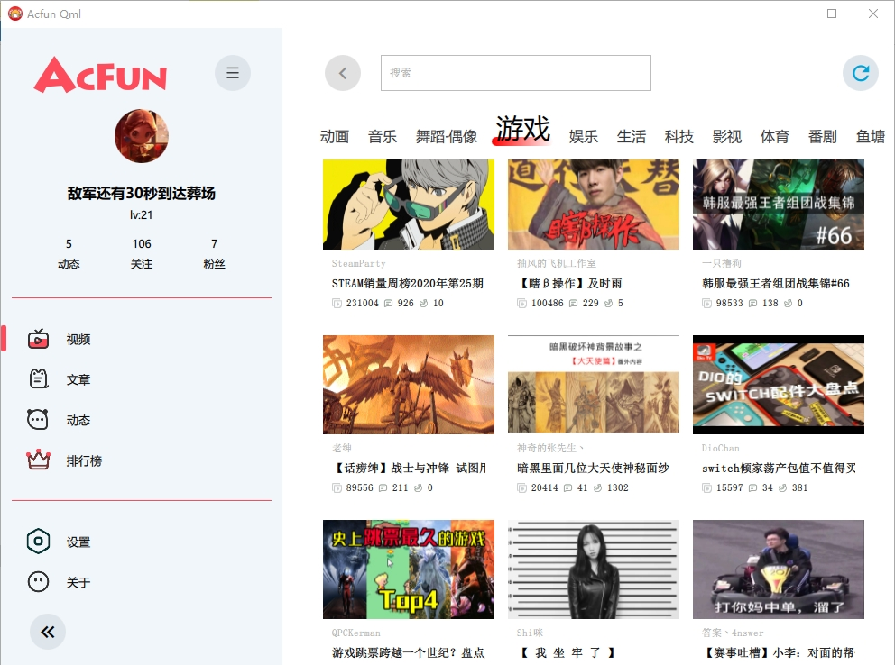

# 声明
本软件非Acfun官方产品，不做任何商业用途，不涉及破解，仅用于学习交流，开发者不会以任何形式为软件本体收费，也不对此开通任何捐赠渠道。用户数据仅在用户与Acfun之间流通，开发者不会窃取任何数据，不会存储用户A站密码（会加密存储认证token到用户本地PC），他人经开源等渠道使用本代码衍生的任何软件与本人无关，请注意A站账户安全。

# Introduction
AcfunQml  is a thirdparty desktop App of Acfun Video & Danmaku wibsite,  build on Qt 5 & Qt Quick 2.x (Qml) & QmlVlc (based on libvlc).

# Features
- Login Acfun and show basic user infomation
	- do not save username/password
	- save token by qtkeychain, auto login next time
- Load Acfun Top Rank Videos
- Load Acfun Videos in deferent channels
- Video
  - pause/resume
  - speed 0.5/1.0/1.5/2.0
  - jump position
  - fill App
  - full Screen
  - mini window
  - resolution change (TODO)
- Danmaku
  - fly
  - top
  - bottom
  - pause/resume
  - modify display opacity
  - send danmaku
    - font size
	- color
	- mode
- Banana
- Favorite
	- add favorite
	- remote favorite
	- favorite list (TODO)
- Like
	- Like count
	- like/unlike (TODO)
- Comment
  - show comment 
  - send comment
  - ac emotion
- Index Page Video List (TODO)
- Video Search (TODO)
- Home page (TODO)
- Circle page (TODO)
- Article page (TODO)
- Setting
  - Hard decode (with problems)
  - Language change
  - Skin change (simple)

# 遇到的问题
- 已经转移到issues页面

# ScreenShots




# Requirements
- Qt 5.12.0 or later
- Qt Quick 2.0 or later
- Libvlc 3.0 or later

# Build
- Download libvlc library (http://ftp.gnome.org/mirror/videolan.org/vlc/last/)
- Build QmlVlc (https://github.com/baoyuanle/QmlVlc)

- Windows:
  - unzip if you download zip package, install if you download the execute package.
  
  - copy `lib` and `include` folder to `3rdparty/vlc/`.
    - declare `typedef __int64 ssize_t;` in `vlc.h` file if you compile on x64.
    - ~~change `#include <vlc/xxx.h>` to `#include <xxx.h>`(remove `vlc/`) if could not find header files.~~
  - copy dynamic link library (dll) files and `plugins` to `{project}/bin` path (the build path)
  
  	Folder tree like:
    ```
      AcfunQml
    	|
    	+--bin
    	|  |
    	|   +--plugins
    	|   +--QmlVlc
    	|  |
		|  |   +--qmldir
		|  |   +--QmlVlcPlugin.dll
		|  |
    	|   +--libvlc.dll
    	|   +--libvlccore.dll
    	|   +--ssleay32.dll(libssl-1_1.dll in high Qt version)
    	|   +--libeay32.dll(libcrypto-1_1.dll in high Qt version)
    	|   +--acfunqml.exe
    	|
    	+--src
    	+--AcfunQml.pro
    ```
  - make ts / qm (translation files)
    - goto \src\trans
	- fix your lupdatePath in trans_update.bat and run
	- run Trans.bat(可选，很慢，自行决定，免费翻译API限制每秒1次翻译请求)(https://github.com/jaredtao/Transer)
	- fix your lreleasePath in trans_release.bat and run
	
  - open the `AcfunQml.pro` with Qt Creator
  
  - build and run

- Mac:
  > TODO

- Linux:
  > TODO


## LICENSE
> Copyright &copy;  baoyuanle Under the [DBAD LICENSE](LICENSE.md)
##
> The project dependent on some other opensource project , see [LICENSES_third](LICENSE_third.md)

## Thanks
> 麻菜 mcplayer(https://github.com/yuriyoung/mcplayer)

> 涛哥 TaoQuick(https://github.com/jaredtao/TaoQuick)

> RSATom QmlVlc(https://github.com/RSATom/QmlVlc)

> qyvlik HttpRequest(https://github.com/qyvlik/HttpRequest)

> BANKA2017(https://github.com/BANKA2017/Acsign)

> 梓喵出没(https://www.azimiao.com/5882.html)

> qtkeychain(https://github.com/frankosterfeld/qtkeychain)

> zhengtianzuo(https://github.com/zhengtianzuo)

> 软件交互视觉很大程度上参考[云之幻](https://github.com/Richasy)的[UWP应用哔哩](https://www.microsoft.com/store/apps/9MVN4NSLT150)。
